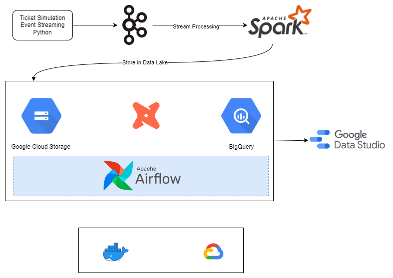

# Ticketsim
A data pipeline with Kafka, Spark Streaming, dbt, Docker, Airflow, GCP and more

## Description

### Objective

The project will stream data from a simulation that sells event tickets and create a data pipeline that consumes the real-time data. The data would then be processed in realtime and stored in data lake every two minutes. An hourly batch job will consume this data, apply transformations and create tables in data warehouse for analytics and reports. We will analyze basic attributes of the data like total users, average waiting time, etc ...

### Data Simulation

Ticketsim is inspired by [article](https://towardsdatascience.com/simulating-real-life-events-in-python-with-simpy-619ffcdbf81f) by Kevin Brown. Using simpy, the program will generate wait and buy ticket events.

### Tools & Technologies

- Cloud - [**Google Cloud Platform**](https://cloud.google.com)
- Containerization - [**Docker**](https://www.docker.com), [**Docker Compose**](https://docs.docker.com/compose/)
- Stream Processing - [**Kafka**](https://kafka.apache.org), [**Spark Streaming**](https://spark.apache.org/docs/latest/streaming-programming-guide.html)
- Orchestration - [**Airflow**](https://airflow.apache.org)
- Transformation - [**dbt**](https://www.getdbt.com)
- Data Lake - [**Google Cloud Storage**](https://cloud.google.com/storage)
- Data Warehouse - [**BigQuery**](https://cloud.google.com/bigquery)
- Data Visualization - [**Data Studio**](https://datastudio.google.com/overview)
- Language - [**Python**](https://www.python.org)

### Architecture

### Final Result

You can watch the dashboard [here](https://datastudio.google.com/reporting/34d7baf7-507a-43fc-b678-bc0e8456e05b)

## Setup

In this project, I used 300$ free credit when create a new GCP account. The project consists of 3 vm instance: 1 ubuntu for running ticketsim and kafka stack, 1 dataproc for running spark jobs and 1 ubuntu for running airflow to orchestrate periodic jobs on data lake and data warehouse. The vm names are listed as in the picture.

### Pre-requisites

- Google Cloud Platform. 
  - [GCP Account and Access Setup](setup/gcp.md)

### Action Parts

- Setup Kafka Compute Instance and start sending messages from Eventsim - [Setup](kafka/README.md)
- Setup Spark Cluster for stream processing - [Setup](spark/README.md)
- Setup Airflow on Compute Instance to trigger the hourly data pipeline - [Setup](setup/airflow.md)
